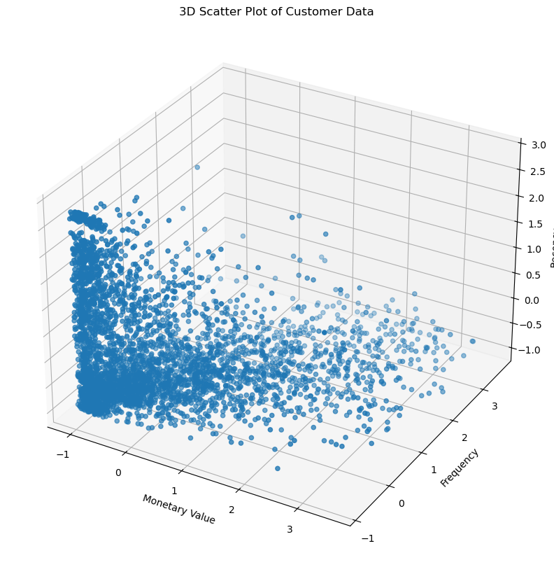
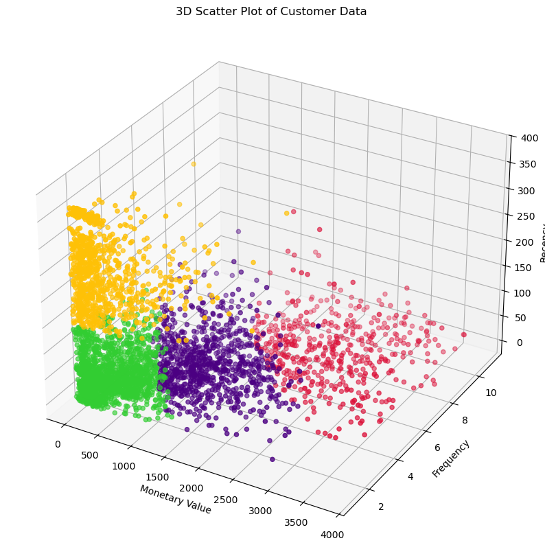
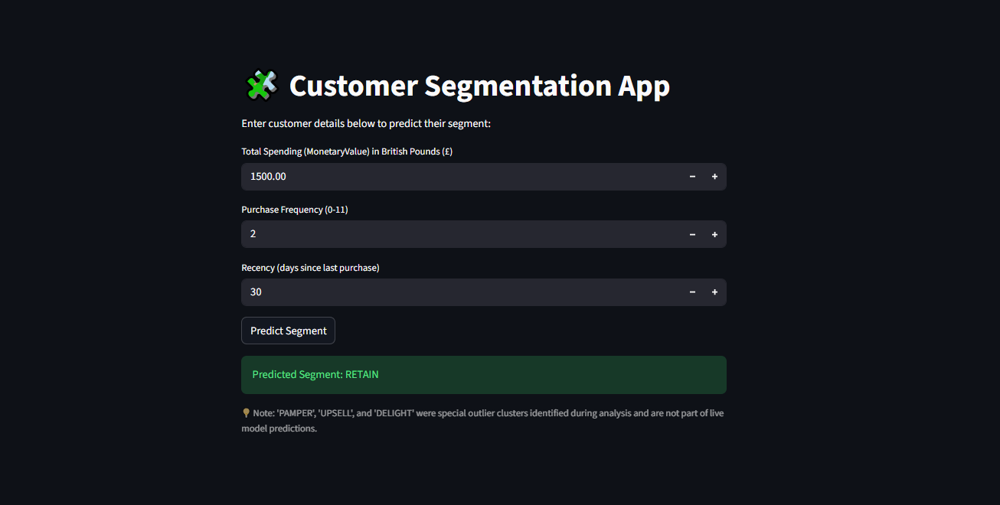
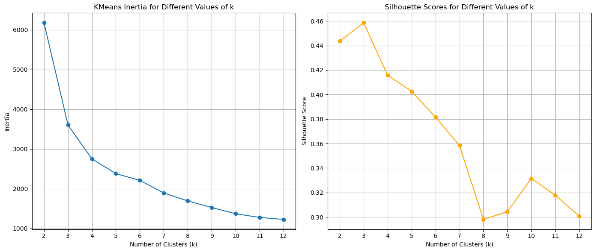
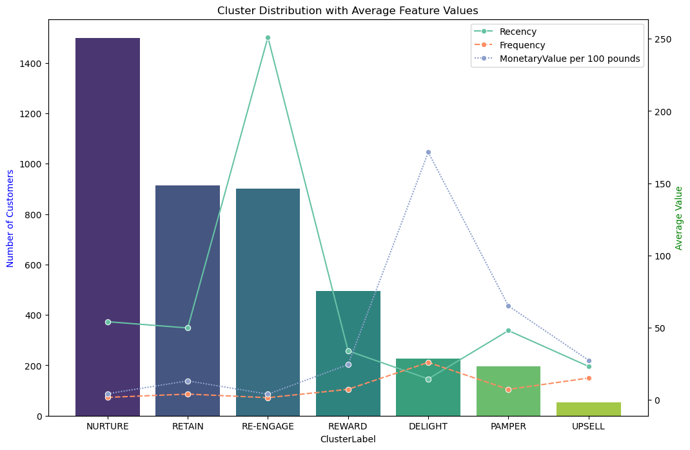

<p align="center" style="margin: 0; padding: 0;">
  
  
</p>

## Table of Contents

[Overview](#overview) <br>
[Requirements](#requirements) <br>
[App Execution Guide](#app-execution-guide) <br>
[Data Acquisition](#data-acquisition) <br>
[Data Preparation](#data-preparation) <br>
[Raw Data Description](#raw-data-description) <br>
[Data Exploration](#data-exploration) <br>
[Modeling](#modeling) <br>
[Summary](#summary) <br>
[Front-end](#front-end) <br>
[Conclusions](#conclusions) <br>
[References](#references) <br>
[About Me](#about-me)

## Overview
This project focuses on Customer Segmentation Analysis using RFM (Recency, Frequency, Monetary) modeling to better understand customer behavior and optimize marketing strategies.
By analyzing transaction data, customers were grouped into distinct clusters that reflect their purchasing habits, loyalty, and value to the business. This analysis helps identify key customer groups — such as loyal customers, potential churners, and new buyers — allowing businesses to tailor marketing strategies for each segment.  
The process involved:
- __Data Cleaning:__ Filtering invalid invoices, removing nulls, and ensuring only valid transactions are analyzed.
- __Feature Engineering:__ Creating RFM metrics to capture essential aspects of customer activity.
- __K-Means Clustering:__ Segmenting customers into meaningful groups based on their RFM values.
- __Cluster Profiling:__ Interpreting clusters to define actionable customer segments such as Retain, Re-Engage, Nurture, and Reward.
- __Outlier Analysis:__ Identifying and analyzing high-value or high-frequency outliers to uncover VIP customer behaviors.
- __Streamlit App:__ Allowing users to predict a customer’s segment in real time.

## Requirements
Python Packages:
- pandas
- numpy
- matplotlib
- seaborn
- scikit-learn
- openpyxl
- streamlit
- joblib  

Installing the packages using the [requirements](requirements.txt) file:  
```
pip install -r .\requirements.txt
```
## App Execution Guide
Run the app locally:
```
streamlit run app.py
```

## Data Exploration
The second step involved exploring and understanding the structure and quality of the dataset before performing any cleaning or segmentation.
#### Steps Performed
* Invoice Inspection
	* Invoice Numbers were examined to detect invalid or canceled transactions.
	* Checked the Invoice column for any non-numeric characters (like 'C' indicating cancellation).
* Stock Code Validation
	* Ensured that product StockCode values followed the expected pattern (5-digit or alphanumeric identifiers)
	* Identified several special codes such as 'POST', 'D', 'BANK CHARGES', 'TEST001', 'gift_0001_80', 'ADJUST', 'DOT', etc. These typically represented non-sale transactions (postage, discounts, adjustments, test entries).
#### Insights
* Found negative quantities corresponding to returns or cancellations.
* Detected special StockCodes representing non-product items that may need to be excluded from RFM analysis.

## Data Cleaning
After identifying anomalies in the exploration phase, the dataset was cleaned to retain only valid sales transactions relevant for RFM segmentation.
#### Steps Performed
* Removing Cancellations and Accounting Entries
    * Canceled or accounting adjustment invoices were identified by the presence of non-numeric characters (like ‘C’ or ‘A’) in the Invoice number. These were removed to keep only valid 6-digit numeric invoices:
        ```python
        df_clean["Invoice"] = df_clean["Invoice"].astype(str)
        df_clean = df_clean[df_clean["Invoice"].str.match("^\d{6}$") == True]
        ```
* Filtering Valid Stock Codes
    * Only product-related StockCode values were retained. Excluded special codes like POST, D, TEST001, etc., by applying a validation mask:
        ```python
        mask = (
            (df_clean["StockCode"].str.match("^\d{5}$") == True)
            | (df_clean["StockCode"].str.match("^\d{5}[a-zA-Z]+$") == True)
            | (df_clean["StockCode"].str.match("^PADS$") == True)
        )
        df_clean = df_clean[mask]
        ```
* Removing Null and Invalid Records
    * Customer ID was a crucial identifier for RFM segmentation, so records with missing IDs were dropped.
    * Transactions with zero price were also removed, as they do not contribute to monetary value.
#### Post-Cleaning Summary
Approximately 23% of records were dropped during cleaning — primarily cancellations, missing IDs, or invalid stock codes.

## Feature Engineering and Data Preparation
This stage focused on transforming transactional data into meaningful customer-level features using the RFM (Recency, Frequency, Monetary) model, identifying outliers, and preparing the data for clustering.
#### Steps Performed
* Creating RFM Metrics: Each customer's purchasing behavior was summarized using three key dimensions:
    * Monetary Value (M): Total amount spent
    * Frequency (F): Number of unique purchase transactions
    * Recency (R): Days since the last purchase
    
| Customer ID |	MonetaryValue |	Frequency |	LastInvoiceDate | Recency |
| :------- | :------: | :-------: | :------: | -------: |
| 12346.00 |	169.36 |	2 |	2023-06-28 13:53:00 |	164 |
| 12347.00 |	1323.32 |	2 |	2023-12-07 14:57:00 |	2 |
| 12348.00 |	221.16 |	1 |	2023-09-27 14:59:00 |	73 |
| 12349.00 |	2221.14 |	2 |	2023-10-28 08:23:00 |	42 |
| 12351.00 |	300.93 |	1 |	2023-11-29 15:23:00 |	10 |

* Outlier Detection and Removal: To ensure robust clustering, statistical outliers were detected using the Interquartile Range (IQR) method for both Monetary Value and Frequency
* Data Scaling: To bring all RFM features to a comparable scale, Z-score normalization was applied using StandardScaler.
* A 3D scatter plot was created to visualize customer distribution across Monetary, Frequency, and Recency dimensions, helping confirm cluster separability and data balance before modeling.


#### Result
- Clean, customer-level dataset with standardized RFM features.
- Outliers removed to maintain cluster quality.
- Data ready for K-Means clustering.

## K-Means Clustering
After preparing and scaling the RFM features, the next step was to group customers with similar purchasing behaviors using the K-Means clustering algorithm.
#### Steps Performed
* Determining the Optimal Number of Clusters (K): To identify the most appropriate number of clusters, two complementary methods were used:
    * Elbow Method 
        * Plotted inertia (within-cluster sum of squares) against various k values (2–12). 
        * The “elbow” point in the plot indicates where adding more clusters no longer significantly reduces inertia.
    * Silhouette Score Method 
        * Calculated Silhouette Scores for the same range of k values to measure cluster separation and cohesion. 
        * A higher Silhouette Score indicates better-defined and well-separated clusters.


Interpretation:
- The Elbow curve showed a noticeable bend around K = 4.
- The Silhouette score also peaked near this value, suggesting strong cluster separation.

Hence, K = 4 was chosen as the optimal number of clusters.
* Fitting the K-Means Model
    ```python
    kmeans = KMeans(n_clusters=4, random_state=42, max_iter=1000)
    cluster_labels = kmeans.fit_predict(scaled_data_df)
    non_outliers_df["Cluster"] = cluster_labels
    ```
    Each customer was assigned to one of four clusters based on their RFM behavior patterns.
* 3D Visualization of Customer Segments


## Cluster Profiling and Business Insights
After clustering, each group of customers was analyzed to interpret their RFM behavior, understand their value to the business, and define actionable strategies for engagement.
### Cluster Analysis
__Cluster 0 (Blue): "Retain"__
Rationale: High-value customers who purchase regularly, though not always recently. The focus should be on retention efforts to maintain their loyalty and spending levels.  
Action: 
- Introduce loyalty or membership programs.
- Send personalized offers and reminders.
- Offer early access to new products or sales.

__Cluster 1 (Orange): "Re-Engage"__
Rationale: Low-value, infrequent buyers who have not purchased recently. The focus should be on re-engagement to bring them back into active purchasing behavior.  
Action: 
- Use targeted marketing campaigns and special discounts.
- Highlight new arrivals or products related to their past purchases.
- Send reminders to encourage them to return and purchase again.

__Cluster 2 (Green): "Nurture"__
Rationale: Low-spending but recent buyers, possibly new customers or early-stage shoppers who need nurturing to increase engagement and value.  
Action:
- Offer welcome discounts and personalized recommendations.
- Provide excellent post-purchase follow-ups.
- Educate them about your brand through content and social engagement.

__Cluster 3 (Red): "Reward"__
Rationale: High-value, frequent, and recent purchasers — the brand’s most loyal and profitable customers. They are the brand's most loyal customers, and rewarding their loyalty is key to maintaining their engagement.  
Action: 
- Implement VIP or tier-based loyalty programs.
- Send exclusive offers and early-bird access.
- Feature them in brand communities or referral programs.

### Outlier Analysis
Before clustering, customers with extreme RFM values (very high Monetary or Frequency scores) were identified as outliers. While excluded from the main clustering to prevent distortion of centroids, these customers hold significant business importance. They were analyzed separately and categorized into three key outlier segments.
```python
overlap_indices = monetary_outliers_df.index.intersection(frequency_outliers_df.index)

monetary_only_outliers = monetary_outliers_df.drop(overlap_indices)
frequency_only_outliers = frequency_outliers_df.drop(overlap_indices)
monetary_and_frequency_outliers = monetary_outliers_df.loc[overlap_indices]

monetary_only_outliers["Cluster"] = -1
frequency_only_outliers["Cluster"] = -2
monetary_and_frequency_outliers["Cluster"] = -3

outlier_clusters_df = pd.concat([monetary_only_outliers, frequency_only_outliers, monetary_and_frequency_outliers])
```  
__Cluster -1 (Monetary Outliers)(Purple) Pamper:__
- Rationale: High spenders but not necessarily frequent buyers. Their purchases are large but infrequent. 
- Action: Focus on maintaining their loyalty with personalized offers or luxury services that cater to their high spending capacity.

__Cluster -2 (Frequency Outliers)(Brown) Upsell:__ 
- Rationale: Frequent buyers who spend less per purchase. These customers demonstrate consistent engagement but contribute modestly to total revenue per transaction. 
- Action: Encourage higher spending by offering bundle deals, loyalty tiers, or product upgrades that reward their frequent interactions.

__Cluster -3 (Monetary & Frequency Outliers)(Pink) Delight:__ 
- Rationale: The most valuable outliers, with extreme spending and frequent purchases. These are top-tier customers driving significant revenue and require special attention. 
- Action: Provide exclusive VIP programs, early access to new products, and personalized recognition to reinforce their loyalty and advocacy.  

### Cluster Distribution and Feature Averages
A combined bar and line chart was created to show:
- The number of customers per cluster, and
- The average Recency, Frequency, and Monetary Value per 100 pounds for each segment.  


## Customer Segmentation App
This interactive Streamlit webapp allows users to predict the customer segment for any given individual based on their Recency, Frequency, and Monetary Value (RFM) scores.
The app uses the trained K-Means model and standard scaler saved from the clustering process.
#### How It Works
* The user enters RFM values.
* The app scales these inputs using the saved scaler.pkl.
* The scaled data is passed into the K-Means model (kmeans_model.pkl).
* The predicted cluster is mapped to one of the following customer segments:
    * Cluster 0: RETAIN
    * Cluster 1: RE-ENGAGE
    * Cluster 2: NURTURE
    * Cluster 3: REWARD
* The resulting segment name is displayed instantly.

#### Note
Outlier clusters (PAMPER, UPSELL, and DELIGHT) were identified during exploratory analysis but are not part of live model predictions.

#### Usage
Run the app locally:
```
streamlit run app.py
```


## Conclusion
This project demonstrates the power of RFM-based customer segmentation in transforming raw transactional data into actionable business insights.
By applying K-Means clustering and analyzing behavioral patterns, customers were classified into distinct groups that represent different levels of engagement, loyalty, and value.

The analysis not only revealed how to retain high-value customers and re-engage inactive ones, but also provided a framework for personalized marketing strategies and resource optimization.
The inclusion of a Streamlit app further extends the project’s utility, enabling real-time predictions for new customers based on their RFM characteristics.

In essence, this project bridges the gap between data science and business strategy, illustrating how clustering and behavioral analytics can drive customer-centric growth and long-term profitability.